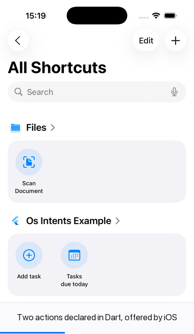

# os_intents

Declare OS-level app actions in Dart. The generator emits the iOS **App Intents**
and Android **AppFunctions** code the system needs at compile time, so Siri,
Spotlight, Shortcuts and on-device agents can run your app's actions — ideally
without opening the app at all.

The pitch in one line: **you never open Xcode.**



Not a mock-up. That is the example app's `addTask` handler, written in Dart,
invoked by iOS from the Shortcuts app. The prompt is the `requestValueDialog`
from the annotation; the answer is the handler's return value. iOS launched the
app's own process in the background to run it and never brought it to the
foreground — measured, not assumed:

```
Runner[91295] OSINTENTS_HOST intent=addTask process=Runner uiEngine=yes
```

> **Status: pre-alpha. Nothing is published.** Both platforms work end to end
> and are verified on a device — iOS on a simulator, Android on an API 36
> emulator — by the two harnesses in [`probe/`](probe/). What is verified, what
> is only compiled, and what has never been observed is listed honestly in
> [docs/status.md](docs/status.md). The one thing still unobserved is Siri
> invoking a phrase by voice.

## What works

| | iOS | Android |
|---|---|---|
| Invoked by the OS, app stays closed | ✅ observed from Shortcuts | ✅ AppFunctions (headless) |
| App shortcuts / launcher entries | ✅ Spotlight, Shortcuts | ✅ generated `shortcuts.xml` |
| Spoken triggers | ✅ Siri phrases | ✅ Assistant capabilities (built-in intents) |
| `@AppEntity` + `@EntityQuery` resolution | ✅ verified on device | — |
| `Execution.background` — runs with no UI | ✅ verified on device | ✅ verified on emulator |
| `Execution.static_` — answers with no engine | ✅ verified on device | ✅ verified on emulator |
| Snippet cards | ✅ compiles and round-trips | — |

Android is two layers. App shortcuts and capabilities cost nothing and are
generated by default; **AppFunctions** — the headless one — is opt-in behind
`sync --android` because it forces `compileSdk 37`, AGP 9.1.1 and Gradle 9.3.1
on your app for something only Android 16+ can run. Details in
[docs/android.md](docs/android.md).

## Pipeline

```bash
dart run build_runner build   # annotations → registry + manifest
dart run os_intents sync      # manifest → ios/Runner/OsIntents/*.swift
dart run os_intents install   # register those files with the Runner target (once)
```

Verified on the example app: three intents, one entity and its query all reach
the built bundle, and the phrases resolve to the provider the OS selects.

```
actions:  AddTaskOsIntent, CompleteTaskOsIntent, DueTodayOsIntent
entities: ProjectEntity
queries:  ProjectQuery
provider: 6Runner18OsIntentsShortcutsV
  AddTaskOsIntent:  "Add a task to ${applicationName}", "New ${applicationName} task"
  DueTodayOsIntent: "What's due today in ${applicationName}"
```

`os_intents sync --check` fails on drift, for CI. `os_intents doctor` reads a
built bundle and reports what the OS will actually see.

## The idea

```dart
@AppIntent(
  title: 'Add task',
  description: 'Creates a new task in the Inbox',
  phrases: [r'Add a task to $app', r'New $app task'],
  execution: Execution.background,
)
Future<IntentResult> addTask({
  @Param(title: 'Title', requestValueDialog: 'What should it be called?')
  required String title,
  @Param(title: 'Due date') DateTime? dueDate,
}) async {
  final task = await TaskRepo.instance.create(title, dueDate);
  return IntentResult.dialog('Added "${task.title}"');
}
```

`dart run build_runner build` turns that into a Swift `AppIntent` struct, an
`AppShortcutsProvider`, a Kotlin `@AppFunction`, and the Dart dispatcher that
routes an invocation back to your function.

## Why another one

Not first, and not alone — five packages occupy this niche, two of them active.
Their sources were read rather than guessed at:

- **`app_intents`** (+ annotations + codegen) is the same shape as this one and
  has a wider API — AppEnum, unions, `PersonName`, `Duration`, App Schema,
  String Catalog localisation. It routes every iOS intent through a **URL
  scheme**, so the app opens, deliberately: App Intents may run in an isolated
  process where no Flutter engine exists. It also requires iOS 17 and Android 16.
- **`flutter_assistant_intents`** keeps a headless iOS engine of its own and
  publishes Android shortcuts from Dart. Its source of truth is YAML.
- `intelligence`, `flutter_app_intents` and `sirikit_media_intents` are iOS-only
  and want hand-written Swift.

So what is actually different here:

| | os_intents |
|---|---|
| Did it reach the OS? | `os_intents doctor` reads the built bundle and tells you — nothing else does |
| Runs without opening the app | measured, from Shortcuts, on iOS 16+ — the isolated-process question settled rather than routed around |
| Android cost | two layers; the version chain is opt-in, not imposed |
| Claims | every one in the table above is backed by a device harness, and what is unproven says so |

Where the project stands, what is missing, and the decisions still open:
**[docs/status.md](docs/status.md)** — including a full read of the neighbours.

Where the project stands, what is missing, and the decisions still open:
**[docs/status.md](docs/status.md)**.

## Layout

```
packages/
  os_intents                      app-facing: annotations, results, registry, test harness
  os_intents_platform_interface   the contract platform implementations fulfil
  os_intents_ios                  iOS bridge, headless engine, snippet view (Swift)
  os_intents_android              Android bridge, headless engine, shortcut routing (Kotlin)
  os_intents_gen                  build_runner builder → Dart + Swift + Kotlin + shortcuts XML
  os_intents_cli                  sync / install / doctor
probe/
  risk1_metadata                  where may generated Swift live? (answered)
  android_appfunctions            Android feasibility and the Kotlin emitter's end-to-end check
  android_shortcuts               what may a generated shortcuts.xml contain? (answered)
docs/
  risk1.md                        experiment design and verdict
  android.md                      both Android layers, and what each costs
  status.md                       the honest inventory
```

Pub workspace — one `flutter pub get` at the root resolves everything.
Flutter version is pinned per-repo via fvm (`.fvmrc`, currently 3.44.8) so this
work cannot disturb other projects on the machine.

## Risk #1 — the question that shapes the architecture

App Intents are registered **at compile time**: Xcode extracts metadata from
Swift types into `Metadata.appintents` inside the app bundle. Nothing declared
at runtime from Dart is ever visible to Siri. So the generator has to put Swift
somewhere the extractor will look — and the open question is whether a Flutter
plugin module counts.

**Answered: it does.** On Flutter 3.44.8 / Xcode 26.0 (Swift Package Manager
integration), an intent declared inside the plugin module lands in
`Metadata.appintents/extract.actionsdata` by itself — no `AppIntentsPackage`
bridge, without ever being referenced from Dart or from the app target:

```json
"fullyQualifiedTypeName": "os_intents_ios.ProbePodIntent",
"isDiscoverable": true,
"openAppWhenRun": false
```

**But the generator does not use that.** Two things overrode it. A published
package lives in `~/.pub-cache`, shared between projects and wiped by
`pub cache repair`, so per-project generated sources could never be written
there; and `build_runner` derives output paths from input paths, so it cannot
reach `ios/` at all. Risk #1b then forced one file into the app target anyway.
Once the Runner target has to be touched once, putting everything there costs
nothing extra — so generated Swift goes to `ios/Runner/OsIntents/`.

What Risk #1 did buy: the runtime bridge ships inside the plugin rather than
being copied into every app, and an app that wants no spoken phrases could skip
the Xcode step entirely.

**Risk #1b, the follow-up: spoken phrases are the exception.** Siri utterances
come from an `AppShortcutsProvider`, and a second probe showed the extractor
takes one only from the app's own module. Declared in a plugin it is silently
ignored — no error, no warning, `root.ssu.yaml` simply never gets written.

| capability | declared in | status |
|---|---|---|
| intents, entities, queries — Shortcuts, Spotlight, agents | plugin module | free |
| spoken "Hey Siri …" phrases | app target, one provider per app | CLI writes one file |

So the iOS half of `os_intents_cli install` is exactly one job: put
`ios/Runner/OsIntentsShortcuts.swift` into the Runner target, once.

Reproduce both:

```bash
./probe/risk1_metadata/run_probe.sh
./probe/risk1_metadata/run_probe_1b.sh
```

## License

MIT — see [LICENSE](LICENSE).

**The code os_intents generates is yours.** The Swift, Kotlin and XML written
into your project by `build_runner` and `os_intents sync` are the output of a
tool, like a compiler's, and carry no obligation from this licence — no notice
to keep, no attribution to add. The licence covers os_intents itself.
